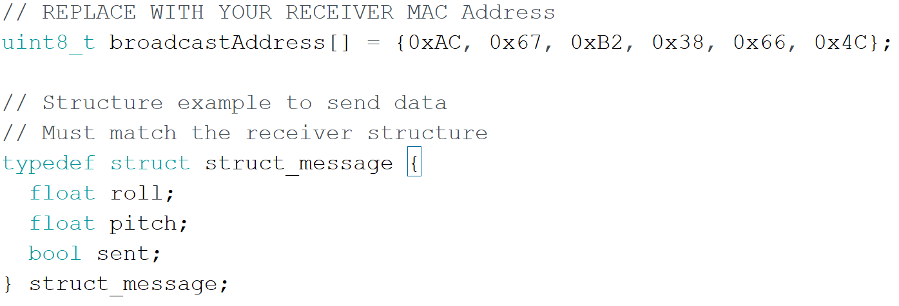

# Gesture Remote Robot Car
I am working on a gesture remote robot car where I can control the direction and speed of a robot car using communication between two different ESP32s. I communicate between these two ESP32s that are connected to my accelerometer and motor driver to send the angels of the accelerometer to the motor driver. Different angles from the accelerometer determine whether the car is moving forward, backward, left, or right and all of this data will be sent to motor driver making it move. 

| **Engineer** | **School** | **Area of Interest** | **Grade** |
|:--:|:--:|:--:|:--:|
| Alessia | Presentation High School | Mechanical Engineering | Incoming Senior

 
   
   
# Final Milestone
My final milestone is finishing the project of creating the gesture remote car and having communication of two different esp32s. I connected my first esp32 to the motor driver and my second esp32 to my accelerometer. After this I used the ESP-NOW One-way Point to Point Communication between my two esp32s. The ESP-NOW is a wireless communication between one or more ESPs. Having a One-way Point to Point Communication allows me to have one ESP32 be the "sender" and the other be the "receiver". The "sender", my accelerometer, sends the values of the angles made from the movement of the accelerometer to the ESP32 that is connected to the motor driver. The motor driver is ziptied ontop of my remote car and the accelerometer is velcroed to a glove that I made. With the accelerometer velcroed to my glove it can sense the angles that are created when I move my hand and send those values to the other ESP32 connected to the motor driver. The motor driver will then change the direction of the motors depending on the angles from the accelerometer.

  

I am able to communicate between the two ESP32s by adding the MAC address of the receiver to both of the codes as well as creating a struct continaing the float roll value, float pitch value, and the bool sent. 

[{:target="_blank" rel="noopener"}

# Second Milestone
My second milestone was building the chassis of my gesture remote car. I also placed the motor driver on top of the chassis and connected my accelerometer to the esp that was also connected to my motor driver. Instead of using three different states to make the car move either forward, backward or stay still, now I use the accelerometer to change direction. An accelerometer identifies the force of gravity in all three axis: x-axis, y-axis, and z-axis. The sensors measure the opposite force of gravity in the accelerometer and the output of the sensors are based on the direction of the force of gravity. The total length of the gravitational vector can be found using the pythagorean theorem with the sensor's output. I use the accelerometer by identifiying the angles at which my hand is, which has the accelerometer on top of it. Based on these angles, I coded it so that if I change the direction of my hand more forward or backward, then depending on the angle, then it'll move the car forward and backward. I also coded it so that in my void loop function I made all my codes for the angles to be after "if" and "else if" statements. To move the car left or right I made both sets of wheels on either side move in opposite directions. For example to turn left I made the left side tires move backwards at a speed of 220 and made the right side of the wheels move forward at a speed of 230. To turn right I made the right side tires move backwards at a speed of 220 and made the left side of the wheels move forward at a speed of 230. This creates a sort of drift motion with the wheels when turning. Also there are two input pins on each motor so for when I want to make the car change direction I change one side of the input pins to go forward and the other backward. Then I mdae the car move at a constant speed of 225, unless I want the car to move left or right. When making the car move left or right then I make the wheels moving forward to be faster than those that are moving backward.

{:target="_blank" rel="noopener"}

# First Milestone
 
My first milestone was controlling the motor driver through the e sp32 serial monitor. A motor driver can control the speed of two motors for my gesutre remote car by controlling the PWM output. PWM is a pulse width modulation, which uses digital signals to emulate analog signals by turning the voltage on and off at a fast constant rate. In the motor driver there is also a H-Bridge that can control the direction of the current flow, which changes the rotation direction of the motor. Using this H-Bridge allows the car to move forward or backward. I first wired up my esp32 to connect with two motors, an external power source, and a motor driver. 

<HTML>

</HTML>
<HTML>

</HTML>
I used the Arduino software to code three different states for the motor driver: forward, backward, and still, which controlled the state at which my motors moved. To code these three different states, I coded three different void functions for forward, backward, and stil. I can change the state of the motors by having the two input pins on each motor be either HIGH or LOW. There are two input pins on the motor driver for each motor that control the rotation direction of each motor. Having both inputs be either HIGH or LOW change Depending on which motor pin is HIGH or LOW, would control the motor to go forward, backward, or to stay still.

 
 

<HTML>
 I also used a pwm signal to keep the motors at a steady state when they are on. I change the state of the motors by inputing 2 different numbers, seperated by a space, into the serial monitor. The three states that I created are: forward, backward, and still. Each direction is based on The first number I put into the serial monitor is either a 1, 2, or 3 depending on what state I want the motors to be in. The second number I use is to represent the speed between 0 to 255 of moving the information from the PC to the esp32. After putting these values into the serial monitor, then it writes back either "Motor Stop", "Motor Forward", or "Motor Backward".
</HTML>

  
   
  

 

{:target="_blank" rel="noopener"}

